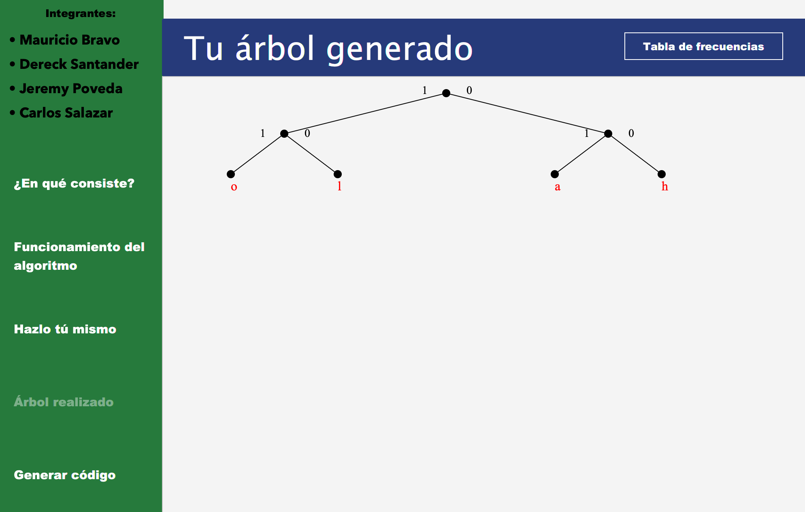
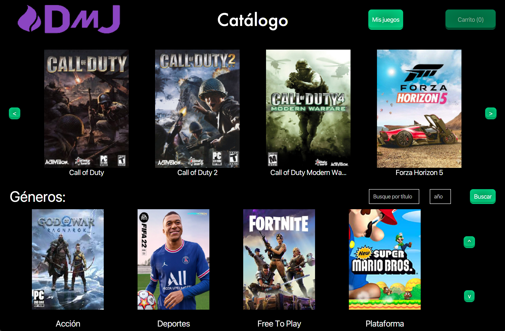
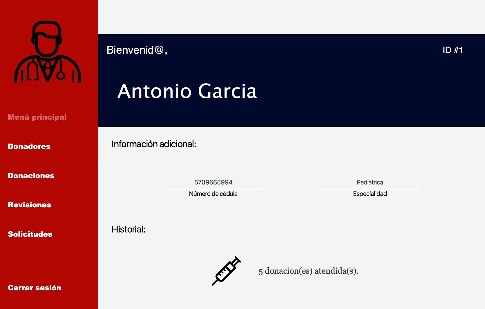
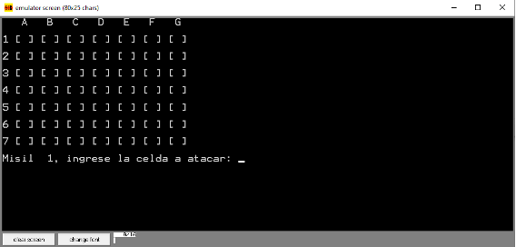

# Mi sitio personal
¡Hola, soy Mauricio Bravo! Soy un apasionado desarrollador de software. Este es mi repositorio personal donde comparto algunos de los proyectos en los que he trabajado.

## Contenido
* [Información personal](#información-personal)
* [Acerca de mí](#acerca-de-mí)
* [Proyectos](#proyectos)
* [Intereses](#intereses)

## Información personal
* Edad: 20 años
* Ocupación: Estudiante de Ingeniería en Computación - ESPOL
* Lugar de residencia: Guayaquil - Ecuador 🇪🇨

## Acerca de mí
- **Experiencia**: He sido ayudante de docencia en las materias de: Fundamentos de Programación, Programación Orientada a Objetos.
- **Lenguajes**: Domino Python, Java y SQL.
- **Objetivos**: Mi objetivo es aprender nuevas tecnologias, conocer más sobre desarrollo de aplicaciones y aportar a la comunidad con mis conocimientos.

## Proyectos
<table border='1' align="center">
  <tr>
    <th>
      <article>
        
#1

        
        <h3>Código de Huffman</h3>
      </article>
    </th>
    <th>
      <article>
        
#2

        
        <h3>Tienda de Videojuegos</h3>
      </article>
    </th>
    <th>
      <article>
        
#3

        
        <h3>Sistema Donación de Sangre</h3>
      </article>
    </th>
    <th>
      <article>
        
#4

        
        <h3>BattleShip en Assembly</h3>
      </article>
    </th>
  </tr>
</table>

## Intereses y Hobbies
* Me llama la atención la inteligencia artificial.
* Sigo contenido relacionado a problemas matemáticos sin resolver.
* Me gusta mucho hacer deporte, andar en bicicleta.
* Soy fanático de las series de misterio.

<!--
**mbravop/mbravop** is a ✨ _special_ ✨ repository because its `README.md` (this file) appears on your GitHub profile.

Here are some ideas to get you started:

- 🔭 I’m currently working on ...
- 🌱 I’m currently learning ...
- 👯 I’m looking to collaborate on ...
- 🤔 I’m looking for help with ...
- 💬 Ask me about ...
- 📫 How to reach me: ...
- 😄 Pronouns: ...
- ⚡ Fun fact: ...
-->
